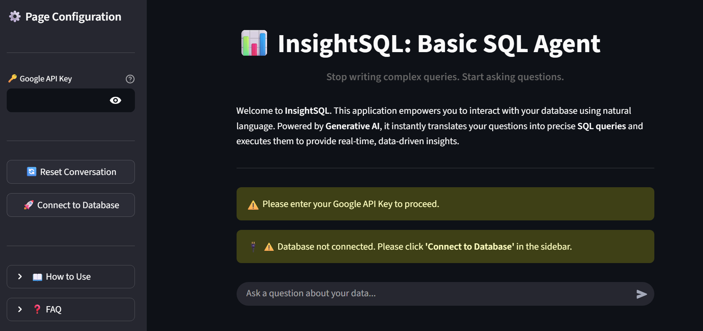
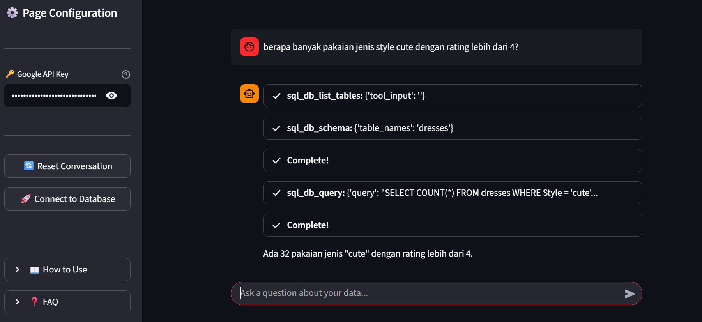

# 📊 InsightSQL (Intelligent Database Assistant)


## 📌 Overview
**InsightSQL** is a streamlined AI Data Assistant powered by Google's latest **Gemini 2.5 Flash**.

It bridges the gap between non-technical users and complex databases. Instead of writing SQL queries manually, users can simply ask natural language questions (e.g., *"What is the most expensive dress?"*), and the AI Agent will intelligently analyze the schema, generate the SQL, execute it, and explain the results in plain English.

## ✨ Key Features

### 🧠 Generative SQL Agent
Powered by `LangChain`'s SQL Toolkit, the agent acts as an autonomous DBA:
1.  **Schema Awareness:** It first looks at your table names and columns to understand the data structure.
2.  **Query Generation:** Translates English questions into syntactically correct SQLite queries.
3.  **Self-Correction:** If a query fails, the agent catches the error and tries to fix the SQL syntax automatically.

### 👁️ Transparent Reasoning (Glass Box AI)
* **Streamlit Callback Handler:** You aren't just getting an answer; you see the "brain" at work. The UI displays the Agent's **Thought, Action, and Observation** loop in real-time.
* **Visual Feedback:** Uses interactive toast notifications (`st.toast`) and status icons to keep you informed about connection states and errors.

### 🛡️ Robust Error Handling
Designed to handle real-world API constraints:
* **Quota Management:** Specifically detects `429 Resource Exhausted` errors from Google API and advises the user.
* **Connection Safety:** Validates database URIs and file existence before crashing.
* **Security:** API Keys are masked and session states are managed securely.

### ⚡ Session & State Management
* **Singleton Pattern:** Ensures the LLM and Toolkit are only initialized once per session to save resources.
* **Smart Reset:** Allows users to reset conversation history without breaking the database connection.

## 🛠️ Tech Stack
* **LLM:** Google Gemini 2.5 Flash (`temperature=0.3` for deterministic SQL).
* **Framework:** Streamlit.
* **Orchestration:** LangChain Community (SQL Agent, SQLDatabaseToolkit).
* **Database:** SQLite via SQLAlchemy.

## ⚠️ Limitations & Disclaimer

### 1. Current Architecture
This version utilizes the standard `create_sql_agent`. While powerful for straightforward queries, it operates primarily as a **Zero-Shot** agent. It may struggle with:
* Extremely complex `JOIN` operations across multiple tables without context.
* Ambiguous column names if the schema is not descriptive.

### 2. Coming Soon: Advanced ReAct Agent 🚀
An advanced version is currently in development! It will upgrade to a **ReAct (Reasoning + Acting) Agent** architecture to provide:
* Better multi-step reasoning.
* Memory persistence across complex analysis.
* Higher accuracy on vague user queries.
*(Stay tuned for the update!)*

### 3. Database Format
* Currently optimized for **SQLite (`.db`)** files only.
* The database file must reside in the same directory as the application.

## 📦 Installation

1.  **Clone the Repository**
    ```bash
    git clone https://github.com/viochris/InsightSQL.git
    cd InsightSQL
    ```

2.  **Install Dependencies**
    ```bash
    pip install -r requirements.txt
    ```

3.  **Setup Your Database**
    * Place your SQLite file (e.g., `dresses.db`) in the project folder.
    * **Crucial:** If your file is named differently, open `app.py` and modify line 104:
    
    ```python
    # Change 'dresses.db' to your actual filename
    db = SQLDatabase.from_uri("sqlite:///your_database_name.db")
    ```

4.  **Run the Application**
    ```bash
    streamlit run app.py
    ```

## 🚀 Usage Guide

1.  **Configuration:**
    * Enter your **Google Gemini API Key** in the sidebar.
2.  **Connect:**
    * Click the **"🚀 Connect to Database"** button.
    * Wait for the "✅ Database Connected!" toast notification.
3.  **Query:**
    * Type your question in the chat bar (e.g., *"Count the total items in the table"*).
    * Expand the **"Thinking..."** box to see the generated SQL query.
4.  **Reset:**
    * Use **"🔄 Reset Conversation"** to clear the chat history but keep the database connection active.

## 📷 Gallery

### 1. Landing Interface

*The clean, user-friendly landing page welcoming users to InsightSQL. It features a clear call-to-action for connecting to the database.*

### 2. Intelligent SQL Execution

*The core experience in action. The agent translates natural language into SQL, executes it, and provides data-driven insights with a transparent reasoning process.*

### 3. Deep Analytical Reasoning
  
*Going beyond simple queries. This example demonstrates the agent's ability to perform comparative analysis and provide qualitative explanations based on the retrieved data.*

---
**Author:** [Silvio Christian, Joe](https://www.linkedin.com/in/silvio-christian-joe)
*"Stop writing complex queries. Start asking questions."*
